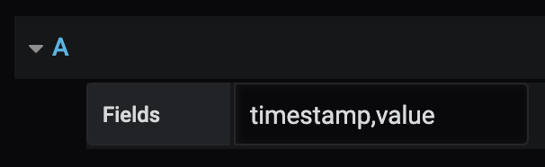

# Writing your first data source plugin for Grafana

Grafana has support for a wide range of data sources like Prometheus, MySQL, or even Datadog. This means that it’s very likely that you can already visualize metrics from the systems you already have set up. In some cases though, you might have an in-house metrics solution that you’d like to add to your Grafana dashboards. Grafana has support for Data Source plugins which lets you build a custom integration for your specific use-case.

In this guide, you’ll learn how to a data source plugin for visualizing CSV files.

## Preparations

### Requirements

- NodeJS
- Typescript
- yarn

### Directory structure

Create a new directory and initialize your package.

```
mkdir grafana-csv-datasource
cd grafana-csv-datasource
yarn init
```

## grafana-toolkit

Tooling for modern web development can be tricky to wrap your head around. While you certainly could write a webpack configuration, for this guide, I'm going to use grafana-toolkit, a CLI application that aims to simplify Grafana plugin development.

First, let’s install grafana-toolkit in our active project:

```
yarn add @grafana/toolkit --dev
```

Next, add @grafana/ui which holds common ReactJS components for Grafana.

```
yarn add @grafana/ui --dev
```

The toolkit requires every plugin to provide a README as well and a LICENSE. If you haven't yet decided which license you want to release your plugin under, for now, just make sure the files are present.

```
touch README.md LICENSE
```

## `plugin.json` and `module.ts `

Create a `src` directory to hold our source code.

We’ll need a `plugin.json` file that describes our plugin.

```js
// src/plugin.json
{
  "id": "<your-github-handle>-csv-datasource",
  "name": "CSV file",
  "type": "datasource",
  "metrics": true,

  "info": {
    "description": "A datasource for loading CSV files",
    "author": {
      "name": "...",
      "url": "..."
    },
    "keywords": [],
    "version": "1.0.0",
    "updated": "2019-09-10"
  },

  "dependencies": {
    "grafanaVersion": "3.x.x",
    "plugins": []
  }
}
```

We also need a `module.ts` file that’s going to configure and export our data source plugin.

```ts
// src/module.ts
import { DataSourcePlugin } from '@grafana/ui';

import { CSVDataSource } from './CSVDataSource';
import { CSVOptions, CSVQuery } from './types';

export const plugin = new DataSourcePlugin<CSVDataSource, CSVQuery, CSVOptions>(CSVDataSource);
```

### Defining our data source

As you may have noticed in our  `module.ts`, we need to provide our data source implementation, as well as definitions for _queries_ and _options_. We'll update these along the way, but for now, let's settle with just the definitions.

```ts
// src/types.ts
import { DataQuery, DataSourceJsonData } from '@grafana/ui';

export interface CSVQuery extends DataQuery {
}

export interface CSVOptions extends DataSourceJsonData {
}
```

Next, let's create the actual implementation for the data source. At this point, it's not doing much, but we'll make sure to change that in a bit.

```ts
// src/CSVDataSource.ts
import { DataQueryRequest, DataQueryResponse, DataSourceApi, DataSourceInstanceSettings } from '@grafana/ui';
import { CSVQuery, CSVOptions } from './types';

export class CSVDataSource extends DataSourceApi<CSVQuery, CSVOptions> {
  constructor(instanceSettings: DataSourceInstanceSettings<CSVOptions>) {
    super(instanceSettings);
  }

  query(options: DataQueryRequest<CSVQuery>): Promise<DataQueryResponse> {
    return Promise.resolve({ data: [] });
  }

  testDatasource() {
    return new Promise((resolve, reject) => {
      resolve({
        status: 'success',
        message: 'Yes',
      });
    });
  }
}
```

By now, you should be able to run `grafana-toolkit plugin:build` successfully. After doing this, you will have a directory called `dist` that contains the production assets for your plugin. The toolkit also generated a `.prettierrc.js` and a `tsconfig.json` that will help you follow the conventions used for Grafana.

## Trying out our new plugin

Also, for development, consider creating a symlink from the plugin directory of your current Grafana installation.

```
ln -s $(pwd) /usr/.../plugins/
```

By doing this you can test new changes by restarting Grafana.

Let's see if our plugin gets picked up by Grafana! Open Grafana in your browser, and navigate to Configuration -> Plugins, and type "csv" to find your plugin. The details view gives your users instructions on how to use the plugin.

Next, navigate to Configuration -> Data Sources, type "csv", and select your data source. For now, this view is going not going to show much, but we should still be able to click the "Save & Test" button. Hopefully, you see the message we configured in `testDatasource`.

Congrats!

## Development workflow

As an exercise, try changing the message returned by  `testDatasource` , rebuild the assets with grafana-toolkit, and restart Grafana. Click the "Save & Test" button again to verify the change was effective.

## Adding data source settings

For most data sources, you'll want to give your users the ability to configure things like hostname or authentication method. Although our CSV example doesn't require authentication at this point, we might want to set the path to the CSV file. We can accomplish this by adding an _options editor_.

```tsx
// src/CSVConfigEditor.tsx
import React, { PureComponent, ChangeEvent } from 'react';

import { DataSourcePluginOptionsEditorProps, DataSourceSettings, FormField } from '@grafana/ui';
import { CSVOptions } from './types';

type CSVSettings = DataSourceSettings<CSVOptions>;

interface Props extends DataSourcePluginOptionsEditorProps<CSVSettings> {}

interface State {}

export class CSVConfigEditor extends PureComponent<Props, State> {
  state = {};

  componentDidMount() {}

  onPathChange = (event: ChangeEvent<HTMLInputElement>) => {
    const { onOptionsChange, options } = this.props;
    const jsonData = {
      ...options.jsonData,
      path: event.target.value,
    };
    onOptionsChange({ ...options, jsonData });
  };

  render() {
    const { options } = this.props;
    const { jsonData } = options;

    return (
      <div className="gf-form-group">
        <div className="gf-form">
          <FormField label="Path" labelWidth={6} onChange={this.onPathChange} value={jsonData.path} placeholder="Path to CSV file" />
        </div>
      </div>
    );
  }
}
```

Grafana editors are in fact ReactJS components. The render method returns the template for the data source settings view.

> _Note:_ You might have noticed that we added the path to an object called `jsonData`. This object is automatically persisted for you, and will be made available to your data source implementation as well.

We also need to add the config editor to our data source by updating `module.ts`:

```ts
// src/module.ts
import { DataSourcePlugin } from '@grafana/ui';

import { CSVDataSource } from './CSVDataSource';
import { CSVConfigEditor } from './CSVConfigEditor';
import { CSVOptions, CSVQuery } from './types';

export const plugin = new DataSourcePlugin<CSVDataSource, CSVQuery, CSVOptions>(CSVDataSource)
  .setConfigEditor(CSVConfigEditor);
```

Build your assets, restart Grafana, and check out the configuration for our data source. There should now be a text field where you can configure the path.

## Querying your data source

Most likely you want your users to be able to select the data they're interested in. For MySQL and PostreSQL this would be SQL queries, while Prometheus has its own query language, called PromQL. Let's add query support for our plugin, using a custom _query editor_.

There's a lot we can do when it comes to querying CSV data, like filtering rows based on a time range of one of the fields. Let's keep it simple for now by letting the user supply a comma separated list of fields to visualize.

Create a new ReactJS component called `CSVQueryEditor`, and have it return a `FormField` from the `@grafana/ui` package.

```tsx
// src/CSVQueryEditor.tsx
import React, { PureComponent } from 'react';

import { FormField, QueryEditorProps } from '@grafana/ui';

import { CSVDataSource } from './CSVDataSource';
import { CSVQuery, CSVOptions } from './types';

type Props = QueryEditorProps<CSVDataSource, CSVQuery, CSVOptions>;

interface State {}

export class CSVQueryEditor extends PureComponent<Props, State> {

  onComponentDidMount() {}

  render() {
    return (
      <div className="gf-form">
          <FormField width={24} label='Fields'></FormField>
      </div>
    );
  }
}
```

Finally, let's configure our data source to use the query editor:

```ts
// src/module.ts
import { DataSourcePlugin } from '@grafana/ui';

import { CSVDataSource } from './CSVDataSource';
import { CSVConfigEditor } from './CSVConfigEditor';
import { CSVQueryEditor } from './CSVQueryEditor';
import { CSVOptions, CSVQuery } from './types';

export const plugin = new DataSourcePlugin<CSVDataSource, CSVQuery, CSVOptions>(CSVDataSource)
  .setConfigEditor(CSVConfigEditor)
  .setQueryEditor(CSVQueryEditor);
```

When configuring your panel, you should have something like this:

